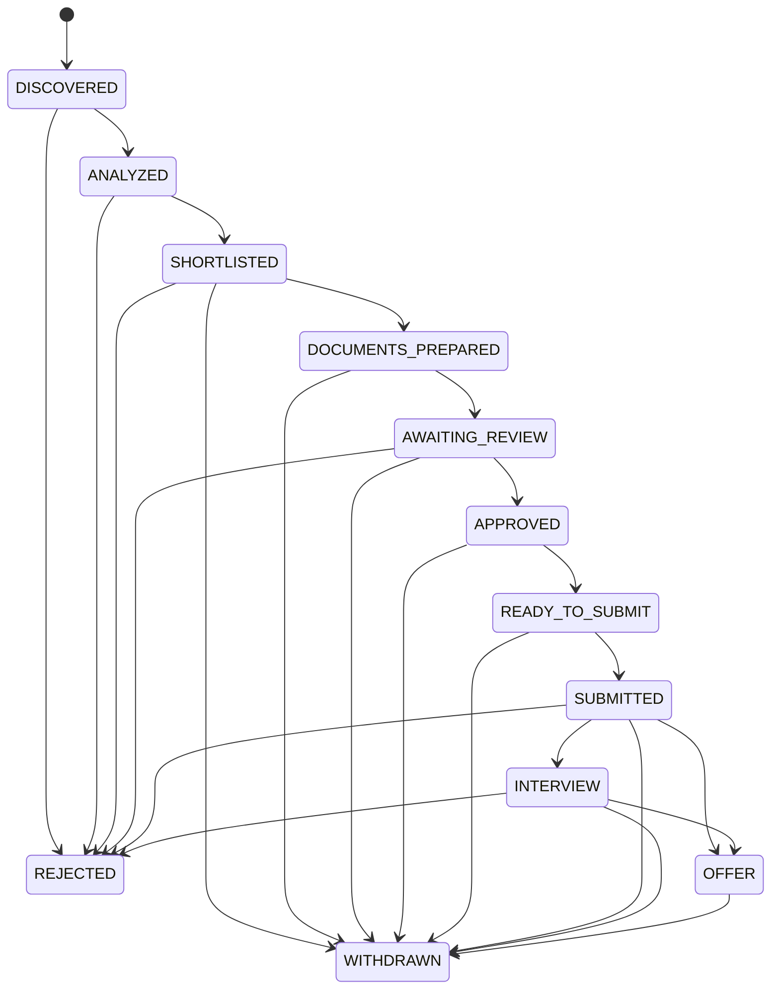

# API reference

The FastAPI service exposes JSON endpoints under `/v1`. Interactive OpenAPI documentation is
available at `/docs` and the machine-readable schema at `/openapi.json` while the API runs.

## Authentication status

There is no production authentication. Every request currently resolves the fixed
`local@example.invalid` development user. User-owned queries are scoped to that dependency,
but the service must not be exposed to untrusted networks. Production startup is blocked.

## Endpoints

| Method and path | Success | Purpose |
| --- | ---: | --- |
| `GET /health` | 200 | Liveness response: `{"status":"ok"}` |
| `POST /v1/profiles` | 201 | Create the single current-user candidate profile |
| `GET /v1/profiles/me` | 200 | Read the current-user profile |
| `PATCH /v1/profiles/me` | 200 | Partially update profile fields or replace supplied child collections |
| `POST /v1/jobs` | 201 | Import and normalize one manually supplied vacancy |
| `GET /v1/jobs` | 200 | List all jobs, newest discovery first |
| `GET /v1/jobs/{job_id}` | 200 | Read one job |
| `POST /v1/applications` | 201 | Track one job for the current user |
| `GET /v1/applications` | 200 | List current-user applications, most recently updated first |
| `POST /v1/applications/{application_id}/analyze` | 200 | Calculate and store deterministic match analysis |
| `POST /v1/applications/{application_id}/documents/generate` | 201 | Generate and validate a versioned document package |
| `GET /v1/applications/{application_id}/documents` | 200 | Read generated document versions |
| `POST /v1/applications/{application_id}/transition` | 200 | Perform one validated status transition |
| `GET /v1/applications/{application_id}/history` | 200 | Read chronological status and approval history |

Collection endpoints are currently unpaginated.

## Strict request behavior

Write models reject unknown properties. Strings are trimmed; whitespace-only required values,
duplicate skill/language facts, and non-alphabetic country/currency codes are rejected. Strings,
lists, mappings, URLs, dates, IDs, and numeric ranges are bounded. Job URLs accept HTTP(S) only
and are stored, never fetched. A profile PATCH rejects explicit null for database-required
fields; supplying `skills`, `languages`, or `employment` replaces that complete child collection.

Common errors:

| Status | Meaning |
| ---: | --- |
| 404 | The user-scoped resource does not exist |
| 409 | Duplicate data, missing prerequisite profile, or invalid workflow state |
| 422 | Request validation failure or missing explicit submission approval |
| 502 | The configured AI provider request failed; provider details are not exposed |
| 503 | AI provider configuration cannot be constructed |

## Minimal workflow example

Create a profile:

```bash
curl -X POST http://localhost:8000/v1/profiles \
  -H 'Content-Type: application/json' \
  -d '{"full_name":"Ana Silva","email":"ana@example.com","eu_work_authorized":true,"requires_sponsorship":false,"skills":[{"name":"Python","years_experience":5}]}'
```

Import a job and use the returned `id` as `JOB_ID`:

```bash
curl -X POST http://localhost:8000/v1/jobs \
  -H 'Content-Type: application/json' \
  -d '{"source":"manual","company":"Example","title":"Data Analyst","country":"PT","description":"Build reports with Python.","requirements":["Python"]}'

curl -X POST http://localhost:8000/v1/applications \
  -H 'Content-Type: application/json' \
  -d '{"job_id":"JOB_ID"}'
```

Use the returned application `id` for analysis and later actions.

## Analysis contract

Analysis is allowed while an application is `DISCOVERED` or `ANALYZED`. The response contains
all nine category scores, matching and missing recognized skills, potential blockers, reasons
for/against applying, confidence, recommendation, and `hard_rejected`. An initial analysis
advances `DISCOVERED` to `ANALYZED`; it never automatically rejects, shortlists, or submits.

## Document generation contract

The request is:

```json
{"language":"en"}
```

Supported languages are `en`, `es`, and `pt`. Generation is allowed for `SHORTLISTED` and
`DOCUMENTS_PREPARED` applications so users can create later versions. The default mock provider
is deterministic; OpenAI mode requires its configured key.

Every version stores provider/model identity, prompt version, input/cached/output token counts,
estimated cost, provider latency, and grounding results. The model selects fact IDs only; final
content is rendered deterministically from stored candidate facts. Valid output advances a
`SHORTLISTED` application to `DOCUMENTS_PREPARED`. Invalid output is stored for audit, its content
is returned as `null`, and application state does not advance.

`GET /v1/applications/{application_id}/documents` returns complete history in descending
version order. Pass `latest_valid=true` to filter and limit in SQL to the newest valid package.

## Application state machine



Transition requests use `{"to_status":"STATUS","reason":"optional","approved_by_user":false}`.
Both `READY_TO_SUBMIT` and `SUBMITTED` require `approved_by_user=true`. The transition, status
history, and audit metadata are written in the same database transaction.
