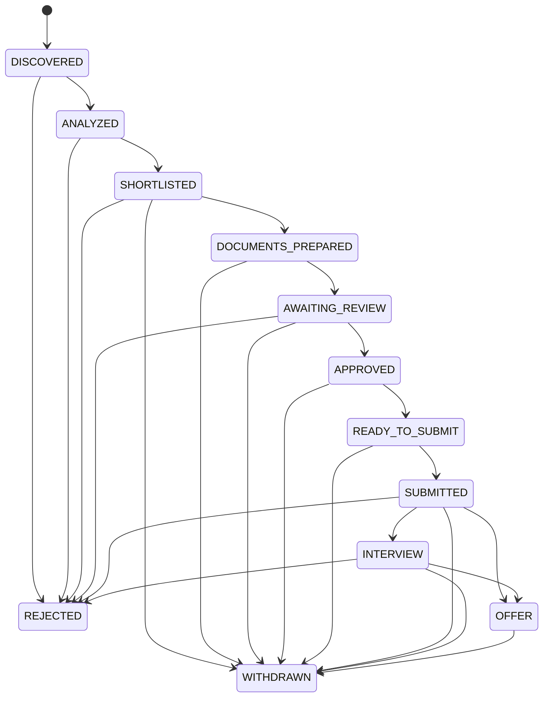

# API reference

The `/v1/discovery` API covers provider status, generated/edited search profiles, configurations,
manual and scheduled runs, manual/CSV/email imports, ranked matches, actions, and notifications. All
records are scoped through the current-user dependency. See [job-discovery.md](job-discovery.md).

| Method | Path | Purpose |
|---|---|---|
| `GET` | `/v1/discovery/providers` | Compliance classification, implementation, configuration, health, and safe error state. |
| `POST/GET/PUT` | `/v1/discovery/search-profile...` | Generate from the approved CV, read, or replace reviewed preferences. |
| `POST/GET/PUT` | `/v1/discovery/configurations...` | Create, list, or replace hard filters, providers, and schedules. |
| `POST/GET` | `/v1/discovery/search-runs` | Execute a manual search or read scoped history. |
| `POST` | `/v1/discovery/scheduler/tick` | Execute currently due configurations idempotently. |
| `POST` | `/v1/discovery/imports/manual|csv|email` | Import user-authorized vacancy content without scraping. |
| `GET` | `/v1/discovery/matches` | Ranked canonical jobs with score, location, provider, role, seniority, workplace, salary, language, date, authorization, sponsorship, and recommendation filters. |
| `GET/POST` | `/v1/discovery/matches/{id}...` | Detailed analysis or explicit save/reject/prepare action. |
| `GET/POST` | `/v1/discovery/notifications...` | Read in-app events or mark one read. |

The `/v1/cv-optimizations` API requires a confirmed CV profile version and an existing deterministic
discovery match for the selected job.

| Method | Path | Purpose |
|---|---|---|
| `POST` | `/v1/cv-optimizations/analyses` | Create an evidence-grounded analysis for `{job_id}`. |
| `GET` | `/v1/cv-optimizations/analyses...` | List or read user-owned analyses and recommendations. |
| `PATCH` | `/v1/cv-optimizations/recommendations/{id}` | Accept, reject, or edit one recommendation. |
| `POST` | `/v1/cv-optimizations/analyses/{id}/recommendations/batch` | Accept safe edits or reset decisions. |
| `POST` | `/v1/cv-optimizations/analyses/{id}/preview` | Preview the revised CV without saving a variant. |
| `POST` | `/v1/cv-optimizations/analyses/{id}/variants` | Save an immutable job-specific CV variant. |
| `GET` | `/v1/cv-optimizations/variants...` | List, read, or compare user-owned variants. |
| `DELETE` | `/v1/cv-optimizations/variants/{id}` | Delete a variant and its export files. |
| `POST` | `/v1/cv-optimizations/variants/{id}/exports` | Render a validated `pdf` or `docx`. |
| `GET` | `/v1/cv-optimizations/exports/{id}/download` | Download a user-owned export. |

The `/v1/cover-letters` API requires an approved CV profile version and a deterministic discovery
match. Generation prepares an application if necessary, but never submits it.

| Method | Path | Purpose |
|---|---|---|
| `POST` | `/v1/cover-letters` | Generate one to three grounded variants for a job. |
| `GET` | `/v1/cover-letters?job_id=...` | List scoped immutable versions, newest first. |
| `GET` | `/v1/cover-letters/{id}` | Read content, validation, evidence, lineage, and provider metadata. |
| `PATCH` | `/v1/cover-letters/{id}` | Save greeting/paragraph/closing edits as a new version. |
| `POST` | `/v1/cover-letters/{id}/validate` | Re-run deterministic claim validation. |
| `POST` | `/v1/cover-letters/{id}/select` | Select one user-owned variant/version. |
| `POST` | `/v1/cover-letters/{id}/approve` | Explicitly approve a valid version. |
| `POST` | `/v1/cover-letters/{id}/regenerate` | Generate from the stored configuration. |
| `DELETE` | `/v1/cover-letters/{id}` | Delete an unapproved draft and private files. |
| `POST` | `/v1/cover-letters/{id}/exports` | Idempotently render approved TXT, DOCX, or PDF. |
| `GET` | `/v1/cover-letters/exports/{id}/download` | Download a user-owned export. |

Generation accepts `job_id`, optional language (`en`, `es`, `pt`), tone, length, variants,
greeting/closing preferences, inclusion switches, and excluded evidence IDs. A custom manager name
requires `hiring_manager_verified=true`. Invalid claims are returned with issue codes and cannot be
approved. See [cover-letters.md](cover-letters.md) for the lifecycle and constraints.

The FastAPI service exposes JSON endpoints under `/v1`. Interactive OpenAPI documentation is
available at `/docs` and the machine-readable schema at `/openapi.json` while the API runs.

## Authentication status

There is no production authentication. Every request currently resolves the fixed
`local@example.invalid` development user. User-owned queries are scoped to that dependency,
but the service must not be exposed to untrusted networks. Production startup is blocked.

## Endpoints

| Method and path | Success | Purpose |
| --- | ---: | --- |
| `GET /health` | 200 | Liveness response: `{"status":"ok"}` |
| `POST /v1/profiles` | 201 | Create the single current-user candidate profile |
| `GET /v1/profiles/me` | 200 | Read the current-user profile |
| `PATCH /v1/profiles/me` | 200 | Partially update profile fields or replace supplied child collections |
| `POST /v1/jobs` | 201 | Import and normalize one manually supplied vacancy |
| `GET /v1/jobs` | 200 | List all jobs, newest discovery first |
| `GET /v1/jobs/{job_id}` | 200 | Read one job |
| `POST /v1/applications` | 201 | Track one job for the current user |
| `GET /v1/applications` | 200 | List current-user applications, most recently updated first |
| `POST /v1/applications/{application_id}/analyze` | 200 | Calculate and store deterministic match analysis |
| `POST /v1/applications/{application_id}/documents/generate` | 201 | Generate and validate a versioned document package |
| `GET /v1/applications/{application_id}/documents` | 200 | Read generated document versions |
| `POST /v1/applications/{application_id}/transition` | 200 | Perform one validated status transition |
| `GET /v1/applications/{application_id}/history` | 200 | Read chronological status and approval history |

Collection endpoints are currently unpaginated.

## Strict request behavior

Write models reject unknown properties. Strings are trimmed; whitespace-only required values,
duplicate skill/language facts, and non-alphabetic country/currency codes are rejected. Strings,
lists, mappings, URLs, dates, IDs, and numeric ranges are bounded. Job URLs accept HTTP(S) only
and are stored, never fetched. A profile PATCH rejects explicit null for database-required
fields; supplying `skills`, `languages`, or `employment` replaces that complete child collection.

Common errors:

| Status | Meaning |
| ---: | --- |
| 404 | The user-scoped resource does not exist |
| 409 | Duplicate data, missing prerequisite profile, or invalid workflow state |
| 422 | Request validation failure or missing explicit submission approval |
| 502 | The configured AI provider request failed; provider details are not exposed |
| 503 | AI provider configuration cannot be constructed |

## Minimal workflow example

Create a profile:

```bash
curl -X POST http://localhost:8000/v1/profiles \
  -H 'Content-Type: application/json' \
  -d '{"full_name":"Ana Silva","email":"ana@example.com","eu_work_authorized":true,"requires_sponsorship":false,"skills":[{"name":"Python","years_experience":5}]}'
```

Import a job and use the returned `id` as `JOB_ID`:

```bash
curl -X POST http://localhost:8000/v1/jobs \
  -H 'Content-Type: application/json' \
  -d '{"source":"manual","company":"Example","title":"Data Analyst","country":"PT","description":"Build reports with Python.","requirements":["Python"]}'

curl -X POST http://localhost:8000/v1/applications \
  -H 'Content-Type: application/json' \
  -d '{"job_id":"JOB_ID"}'
```

Use the returned application `id` for analysis and later actions.

## Analysis contract

Analysis is allowed while an application is `DISCOVERED` or `ANALYZED`. The response contains
all nine category scores, matching and missing recognized skills, potential blockers, reasons
for/against applying, confidence, recommendation, and `hard_rejected`. An initial analysis
advances `DISCOVERED` to `ANALYZED`; it never automatically rejects, shortlists, or submits.

## Document generation contract

The request is:

```json
{"language":"en"}
```

Supported languages are `en`, `es`, and `pt`. Generation is allowed for `SHORTLISTED` and
`DOCUMENTS_PREPARED` applications so users can create later versions. The default mock provider
is deterministic; OpenAI mode requires its configured key.

Every version stores provider/model identity, prompt version, input/cached/output token counts,
estimated cost, provider latency, and grounding results. The model selects fact IDs only; final
content is rendered deterministically from stored candidate facts. Valid output advances a
`SHORTLISTED` application to `DOCUMENTS_PREPARED`. Invalid output is stored for audit, its content
is returned as `null`, and application state does not advance.

`GET /v1/applications/{application_id}/documents` returns complete history in descending
version order. Pass `latest_valid=true` to filter and limit in SQL to the newest valid package.

## Application state machine



Transition requests use `{"to_status":"STATUS","reason":"optional","approved_by_user":false}`.
Both `READY_TO_SUBMIT` and `SUBMITTED` require `approved_by_user=true`. The transition, status
history, and audit metadata are written in the same database transaction.

## PDF CV import contract

All routes use the current-user dependency. Raw page text, storage keys, and document hashes are
never returned by normal read responses.

| Method and path | Contract |
| --- | --- |
| `POST /v1/cv-imports` | Multipart field `file`; validates and processes one PDF. Returns 201 with the review draft, or a scanned-document `TEXT_EXTRACTED` result. |
| `GET /v1/cv-imports` | Newest-first import summaries. |
| `GET /v1/cv-imports/{id}` | Status, safe metadata, validation, model metadata, and the grounded draft. This is also the status/result polling endpoint. |
| `PATCH /v1/cv-imports/{id}` | Body `{"draft": CvProfileDraft}`. Allowed only during `AWAITING_REVIEW`; non-grounded edits are relabelled as user-confirmed. |
| `GET /v1/cv-imports/{id}/compare` | Existing-profile conflicts and additive skills. |
| `POST /v1/cv-imports/{id}/confirm` | Body `{"strategy":"merge|replace","accept_conflicts":false}`. Creates a profile version and returns it. |
| `GET /v1/cv-imports/{id}/export` | Import metadata/draft plus approved versions as portable JSON. |
| `DELETE /v1/cv-imports/{id}/file` | Deletes only the stored PDF; returns 204. |
| `DELETE /v1/cv-imports/{id}` | Deletes the import and stored PDF; approved profile data remains; returns 204. |

`DELETE /v1/profiles/me` deletes the normalized profile and its approved profile-version snapshots;
CV import records remain until individually deleted, allowing the user to choose the scope of data
deletion. Existing application tracking records are not silently deleted.

`CvProfileDraft` covers personal/contact details, headline, summary, technical and soft skills,
languages, employment, education, certifications, projects, achievements, preferences, salary,
availability, work authorization, sponsorship, relocation, and declared/calculated experience.
Every scalar carries `value`, `confidence`, `ambiguous`, and `evidence`; list facts carry value,
confidence, and evidence. Evidence has `page`, exact `quote`, and `method` (`ai`, `deterministic`,
or `user`). See [`cv-import.md`](cv-import.md) for error and state semantics.
