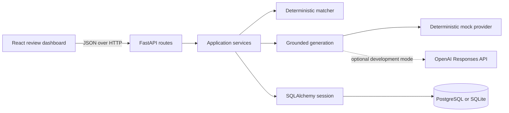
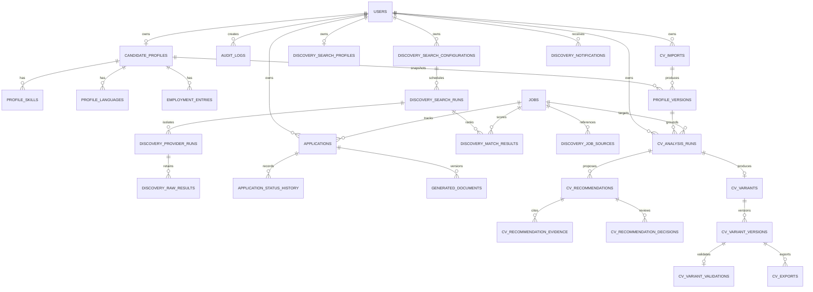
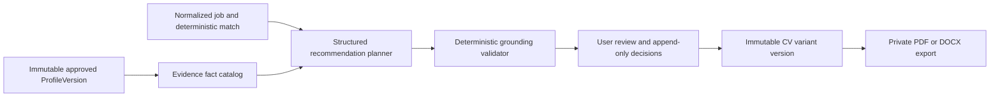

# Architecture and data model

The discovery provider trust boundary, database-backed scheduler, normalization, canonicalization, and
ranking pipeline are documented in [job-discovery.md](job-discovery.md).

## Runtime architecture

The repository contains a React/Vite dashboard and a modular FastAPI API. Pydantic validates
the public boundary, service/domain modules own business rules, SQLAlchemy owns persistence,
and Alembic owns schema evolution. PostgreSQL is used by Compose; SQLite is supported for
native development and deterministic tests.

The browser never contacts an AI provider. Provider calls are synchronous because the API
currently returns a completed document package. The service ends its read transaction before
the external request, then reacquires and revalidates the application row under a lock before
version allocation and persistence. No queue, worker, Redis, or shared cache exists.

## Module responsibilities

| Module | Responsibility |
| --- | --- |
| `app/main.py` | HTTP routes, dependency wiring, user-scoped resource loading, response compression |
| `app/services.py` | Workflow transitions, audit events, deduplication, analysis and document persistence |
| `app/matching.py` | Pure deterministic scoring and configurable hard blockers |
| `app/ai.py` | Candidate fact construction, prompt boundaries, providers, and grounding validation |
| `app/cv.py` | PDF validation/storage, extraction, grounding, normalization, comparison, retention, and profile persistence |
| `app/cv_ai.py` | Strict CV extraction providers, prompt boundary, deterministic parser, and fallback |
| `app/cv_schemas.py` | Evidence-bearing CV draft, comparison, import, and version contracts |
| `app/cv_optimization_ai.py` | Structured recommendation provider, fact catalog, prompt boundary, and claim validator |
| `app/cv_optimization.py` | User-scoped analysis, decisions, preview, immutable variants, and comparison |
| `app/cv_exports.py` | Deterministic DOCX/PDF rendering and private traversal-safe storage |
| `app/cover_letter_ai.py` | Strict evidence-plan provider, prompt boundary, fallback, and verified company facts |
| `app/cover_letters.py` | Language/greeting resolution, deterministic prose, claim validation, versioning, and approval |
| `app/cover_letter_api.py` | Thin user-scoped cover-letter and private export routes |
| `app/schemas.py` | Strict request validation and public response contracts |
| `app/models.py` | SQLAlchemy tables, relationships, constraints, and indexes |
| `app/config.py` | Typed environment configuration and production fail-closed guard |

Cover letters reuse the existing application, approved profile version, deterministic match, AI
settings, audit service, and private export storage. `GeneratedDocument.document_type` separates
legacy application packages from `COVER_LETTER` records without duplicating persistence. Edited
letters point to `parent_document_id`; `DocumentExport` owns format-specific storage metadata. The
service commits before the provider call and then revalidates job, profile, match, and application
identity before allocating versions under a row lock.

## Deterministic matching

The matcher scores title (15), required skills (25), preferred skills (10), experience (10),
location/remote (10), language (10), EU work authorization (10), salary (5), and industry (5).
Environment variables configure allowed countries and hard-rejection policies. Matching never
changes an application to rejected or submitted; it stores an explanation and advances a newly
discovered application only to `ANALYZED`.

## AI generation and safety

Candidate facts and vacancy content are serialized into separate delimiter-safe data blocks.
The default mock provider is deterministic. OpenAI development mode uses the Responses API to
return only a strict Pydantic plan of existing candidate fact IDs. Application code validates the
plan and renders every document sentence from fixed multilingual templates and stored facts; no
model-authored prose reaches the response. Defense-in-depth validation still checks citations,
numbers, skills, sponsorship semantics, and keyword comparisons. Invalid versions cannot advance
application state. See [`ai-architecture.md`](ai-architecture.md) for every prompt and control.

## Data model

Jobs are deduplicated by unique source/external ID, normalized URL, and a stable content hash.
Applications are unique per user/job. Status history and audit logs are append-only records of
workflow actions; generated documents are unique per application/version. Composite indexes
support ordered job, application, and history queries.

CV uploads are streamed to a private local-storage boundary under generated UUID keys. PDF and AI
work run in a worker thread so the async server event loop remains responsive. Extracted pages stay
in the user-scoped import record to support evidence review; immutable profile versions preserve the
entire approved rich profile while the existing normalized profile tables receive the fields used by
matching and generation. This avoids widening the existing profile API contract.

## Trust and authorization boundaries

Profile, application, history, and document routes scope queries to the current user dependency.
That dependency currently resolves one fixed local development user and is not authentication.
Jobs form a global catalog in the current single-user design. `APP_ENV=production` rejects
startup until real authentication and tenant ownership are implemented.

Vacancy text, profile free text, imported fields, and provider payloads are untrusted. They are
validated at the API boundary and never interpolated into SQL or system/developer instructions.

## Known scaling boundaries

- Job and application collection endpoints are unpaginated and grow linearly with record count.
- Discovery endpoints are bounded to 500 ranked rows and ten provider pages per query; long-term
  catalogs will need cursor pagination and archival.
- AI generation occupies a request worker while the provider responds; adding background work
  requires a new status/polling contract and durable queue.
- There is no shared response cache; mutable user data is read directly from the database.
- The frontend remains a single-screen application; critical CV and discovery journeys have browser
  tests, but component-level coverage is not measured separately.

## Job-specific CV variant flow

See [cv-optimization.md](cv-optimization.md) for validation, lifecycle, and export contracts.
